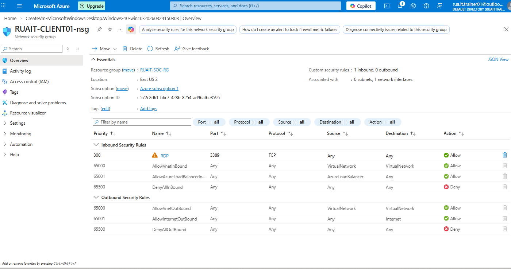
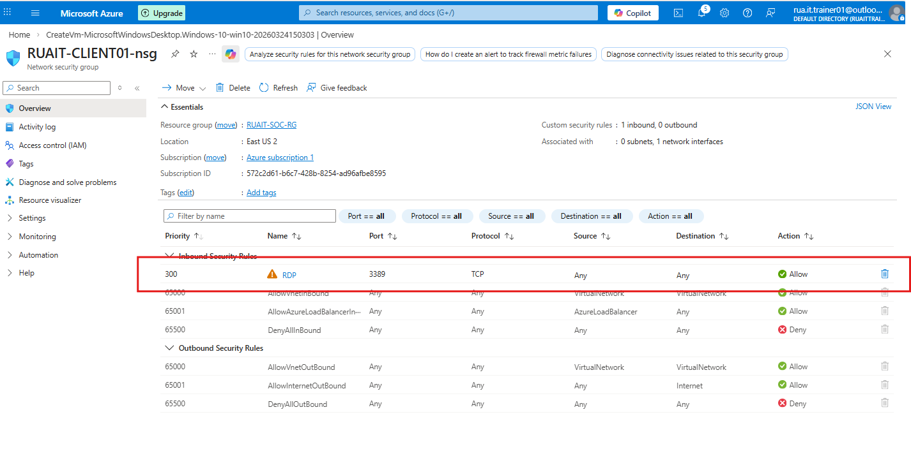
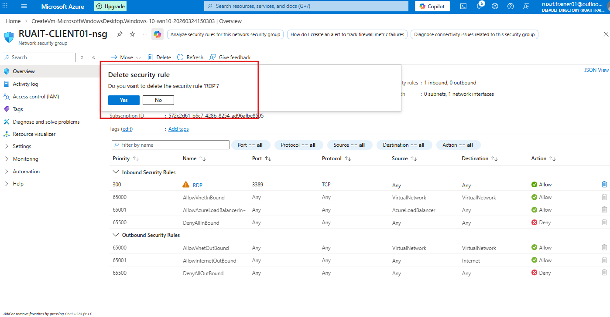
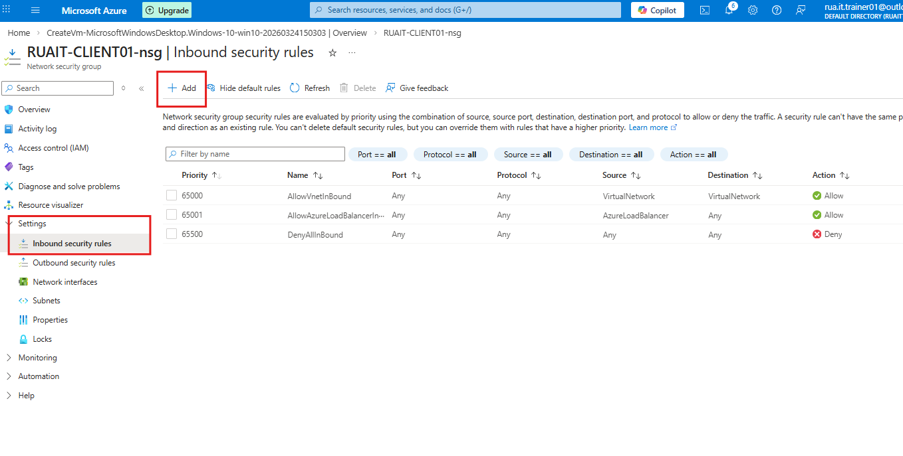
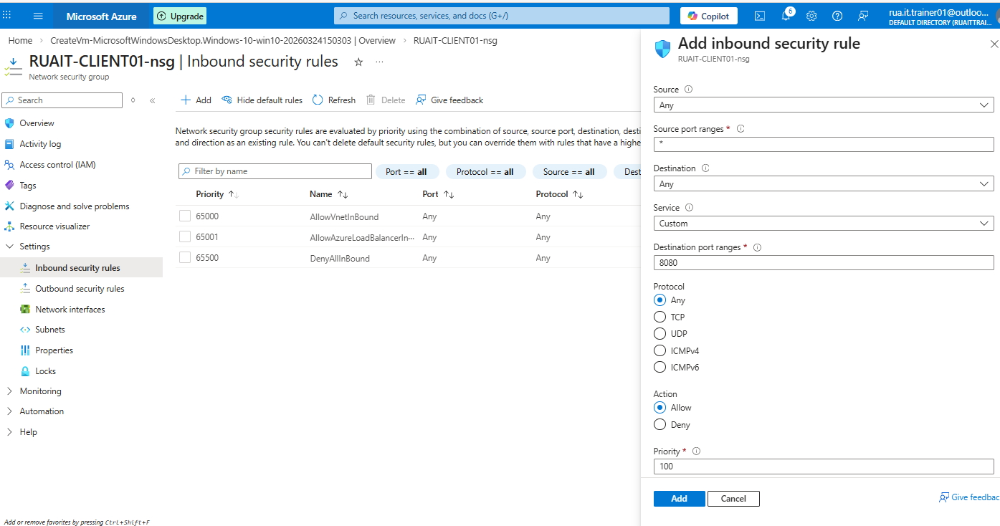
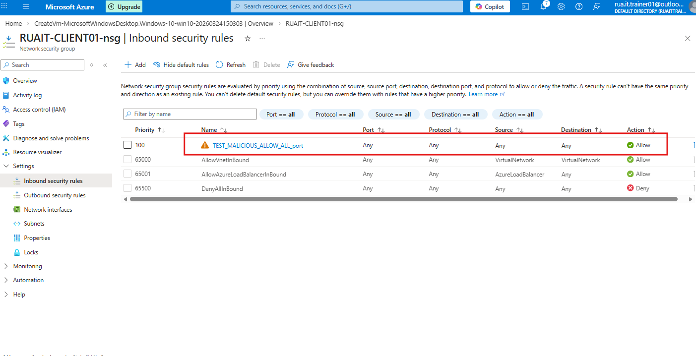

## Objective 1 - Adjust Azure VM Network Security Group
In this scenario I will delete the default RDP port 3389 security rule then I will be creating a new MALICIOUS rule for RDP traffic to expose
interet traffic to VM.

### Delete the default rule

### Add a new security rule - ALLOW ANY TRAFFIC

