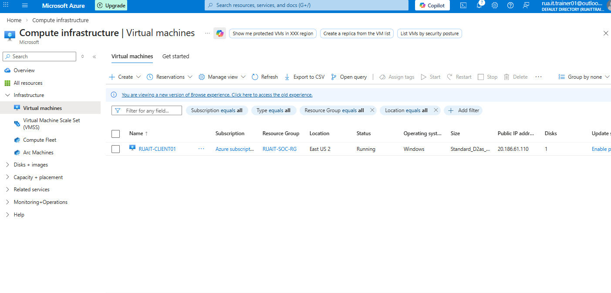
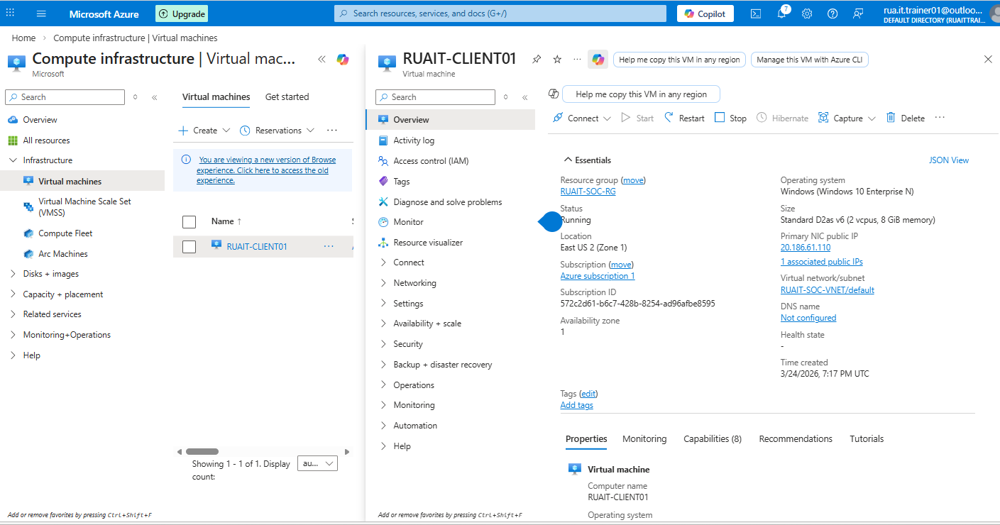
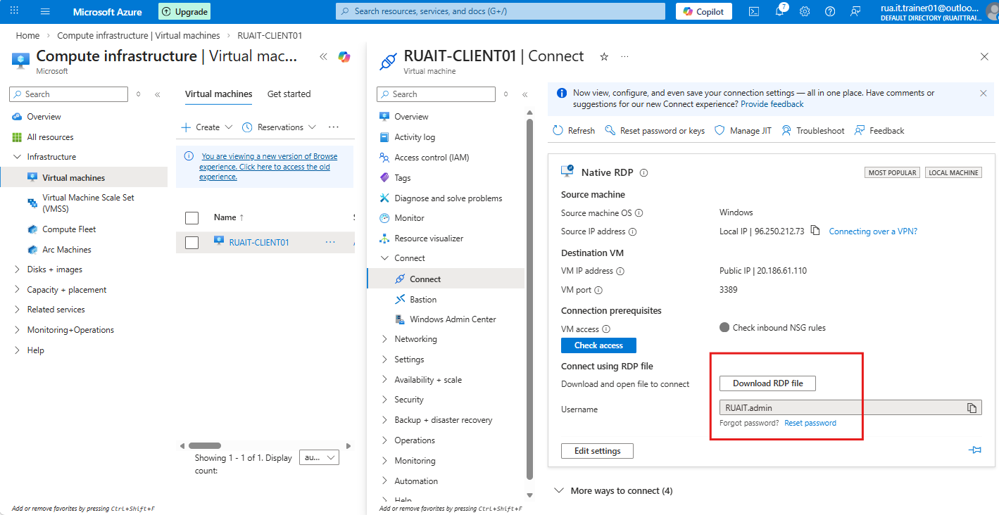
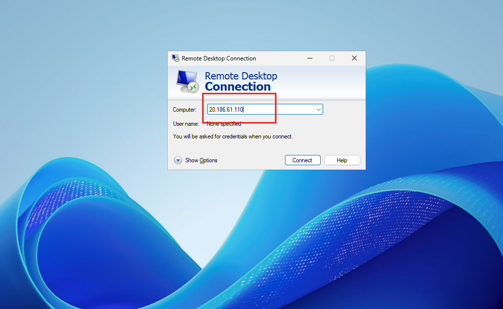
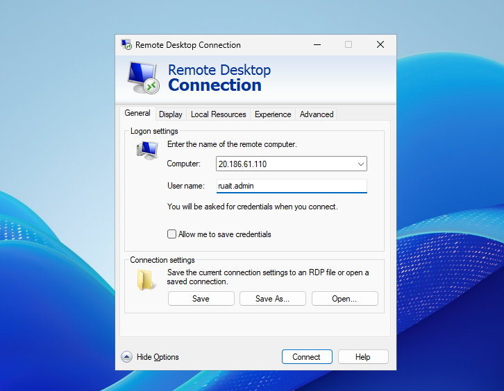
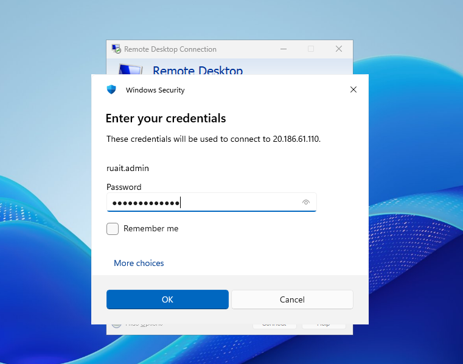
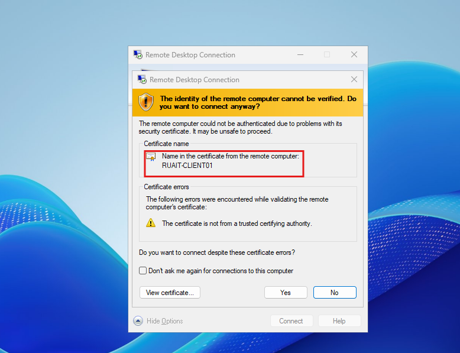
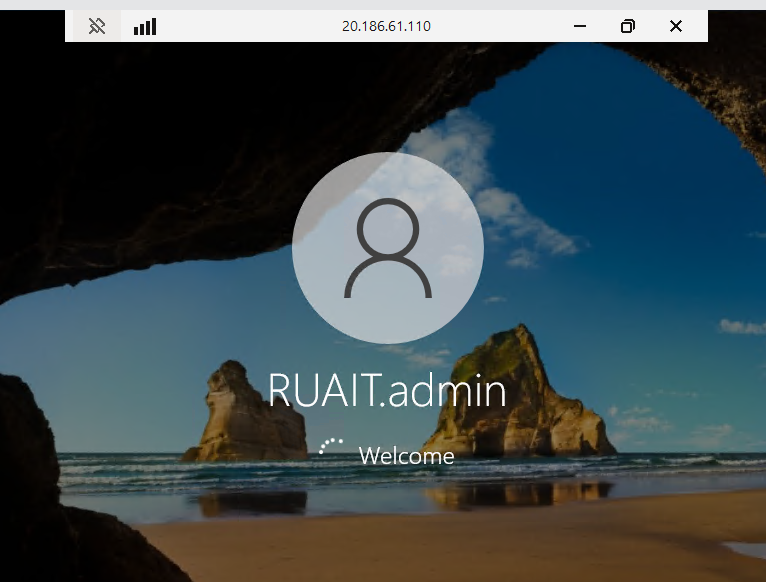
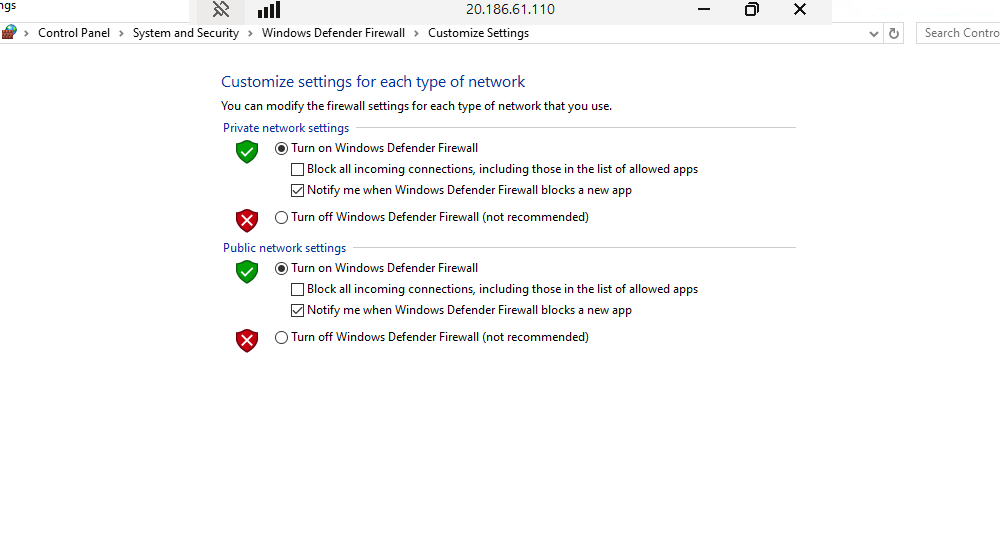
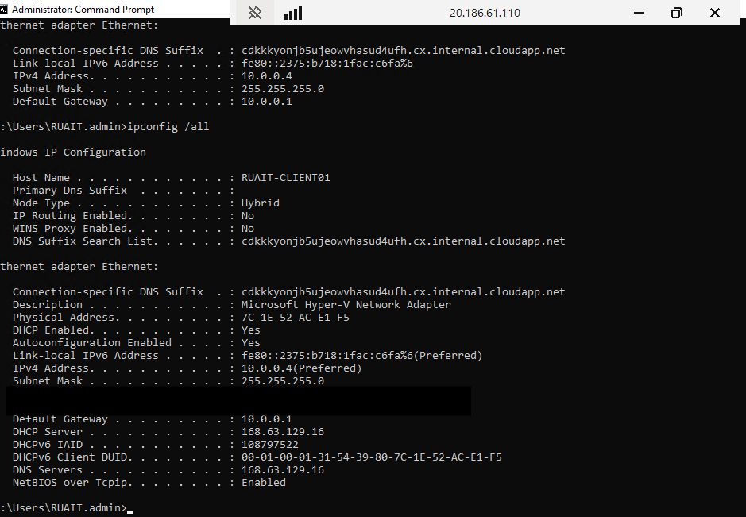

## Objective 1 - Create security events within test VM (RUAIT-PC)

I logged into the VM using the account created and review the windows firewall via the public IP address. Type the password into VM incorrectly few times to create some security login events to review. Once some events are created I will created a collector review them within the Sentinel dashboard.

Select the VM within Azure Dashboard:

Download the RDP file

Connect to the VM using the Public IP address

Turn off the firewall from the VM

