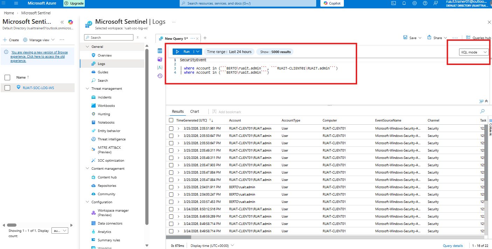
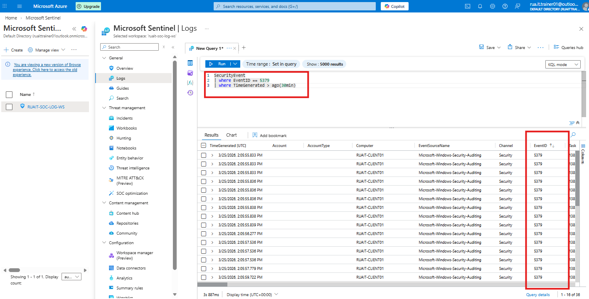
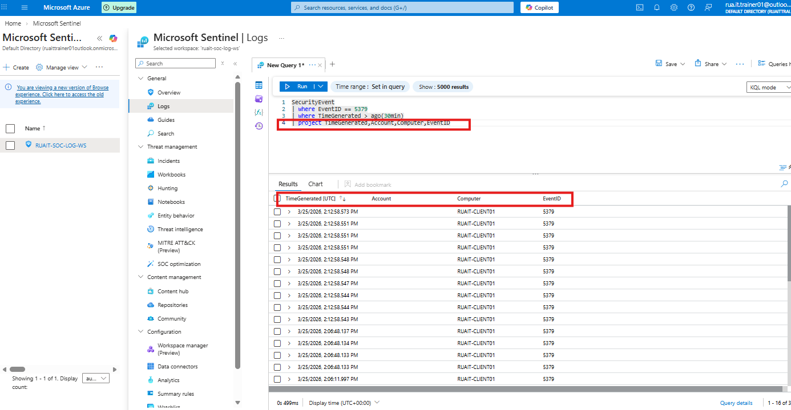

## Objective - Filter logs by running KQL queries
The objective is to filter information being injected by the collector of logs from the VM we created. We are specifically looking at security events
and filtering out information using the KQL query prompt.

